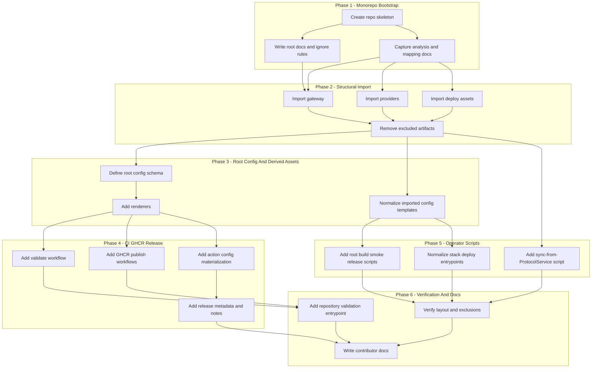

# Dependency Graph

```mermaid
flowchart TD
    subgraph P1[Phase 1 - Monorepo Bootstrap]
        P1A[Create repo skeleton]
        P1B[Write root docs and ignore rules]
        P1C[Capture analysis and mapping docs]
    end

    subgraph P2[Phase 2 - Structural Import]
        P2A[Import gateway]
        P2B[Import providers]
        P2C[Import deploy assets]
        P2D[Remove excluded artifacts]
    end

    subgraph P3[Phase 3 - Root Config And Derived Assets]
        P3A[Define root config schema]
        P3B[Add renderers]
        P3C[Normalize imported config templates]
    end

    subgraph P4[Phase 4 - CI GHCR Release]
        P4A[Add validate workflow]
        P4B[Add GHCR publish workflows]
        P4C[Add action config materialization]
        P4D[Add release metadata and notes]
    end

    subgraph P5[Phase 5 - Operator Scripts]
        P5A[Add root build smoke release scripts]
        P5B[Add sync-from-ProtocolService script]
        P5C[Normalize stack deploy entrypoints]
    end

    subgraph P6[Phase 6 - Verification And Docs]
        P6A[Verify layout and exclusions]
        P6B[Write contributor docs]
        P6C[Add repository validation entrypoint]
    end

    P1A --> P1B
    P1A --> P1C
    P1B --> P2A
    P1C --> P2A
    P1C --> P2B
    P1C --> P2C
    P2A --> P2D
    P2B --> P2D
    P2C --> P2D
    P2D --> P3A
    P2D --> P3C
    P3A --> P3B
    P3B --> P4A
    P3B --> P4B
    P3B --> P4C
    P4C --> P4D
    P3C --> P5A
    P3C --> P5C
    P2D --> P5B
    P4A --> P6C
    P4B --> P6C
    P4D --> P6B
    P5A --> P6A
    P5B --> P6A
    P5C --> P6A
    P6A --> P6B
    P6C --> P6B
```

